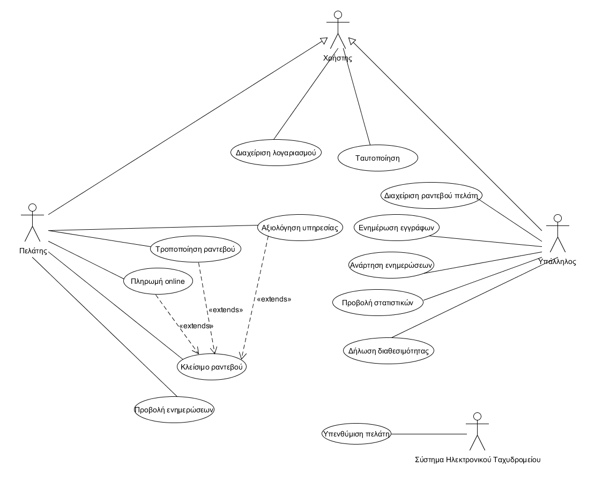

Διαχείριση κομμωτηρίου
========================

Η εφαρμογή που έχουμε αναλάβει απευθύνεται στα κομμωτήρια που χρειάζονται ένα  εύχρηστο σύστημα διαχείρισης των υπηρεσιών τους. Βασικοί στόχοι είναι η βελτίωση της εμπείριας του χρήστη στο να κανονίζει τα ραντεβού του μέσω μιας εύχρηστης και ευέλικτης διεπαφής που παρέχεται από την εφαρμογή και όχι μόνο τηλεφωνικά, καθώς και η σημαντική διευκόλυνση της δουλείας που έχουν αναλάβει οι υπεύθυνοι του καταστήματος.

Λειτουργίες Συστήματος 
========================

Καθολικές δυνατότητες:
-----------------------------------

* ο κάθε χρήστης θα έχει την δυνατότητα σύνδεσης στο σύστημα με την παροχή των κατάλληλων διαπιστευτηρίων.
* ο κάθε χρήστης θα έχει τη δυνατότητα τροποποίησης των στοιχείων του λογαριασμού του.

Δυνατότητες του πελάτη:
--------------------------------------

* θα έχει την
δυνατότητα να βλέπει τις διαθέσιμες ώρες που έχει το κομμωτήριο και να κλείνει ραντεβού στο κομμωτήριο τις ώρες που επιλέγει.
* θα έχει την δυνατότητα ακύρωσης ή τροποποίησης της ώρας του
ραντεβού του.
*  θα έχει την δυνατότητα να βλέπει τις
τιμές / εκπτώσεις / γενικες παροχές του κομμωτηρίου.
* θα έχει την δυνατότητα αξιολόγησης της υπηρεσίας που του προσφέρθηκε.
* θα του παρέχεται η δυνατότητα πληρωμής online.

Δυνατότητες του υπαλλήλου του συστήματος:
---------------------------------------

* θα έχει την
δυνατότητα να κλείνει ή να τροποποιεί ή να ακυρώνει ραντεβού ραντεβού για τον πελάτη.
* θα έχει την δυνατότητα προβολής των στατιστικών & αξιολογήσεων υπηρεσιών του κομμωτηρίου.
* θα έχει τη δυνατότητα να δηλώνει τη διαθεσιμότητα του για κάθε παρεχόμενη υπηρεσία για τα ωράρια λειτουργίας του κομμωτηρίου.
* θα έχει τη δυνατότητα ανάρτησης ενημερώσεων για διάφορες υπηρεσίες κλπ.
* θα έχει τη δυνατότητα να αναρτεί / ενημερώνει λογιστικά έγγραφα που αφορούν το κομμωτήριο.

Δυνατότητες του συστήματος ηλεκτρονικού ταχυδρομείου
----------------------------------------------------
* θα στέλνει μήνυμα υπενθύμισης στους πελάτες που έχουν κλείσει ραντεβού.

Άλλες λειτουργίες:
------------------
* Κάθε μήνα το σύστημα θα παράγει αναφορές όσον αφορά την δημοτικότητα κάθε υπηρεσίας.

============================
