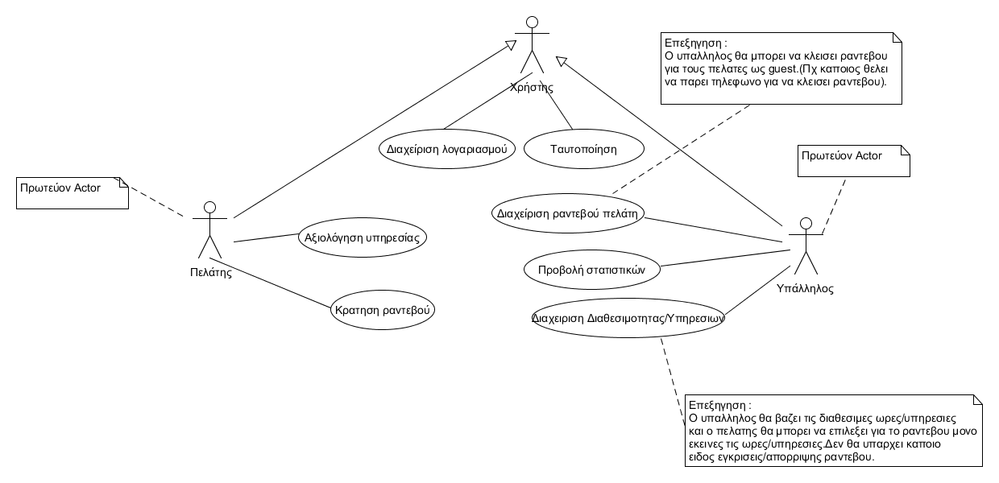
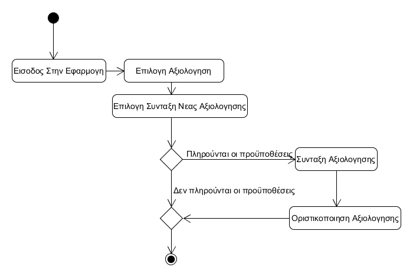
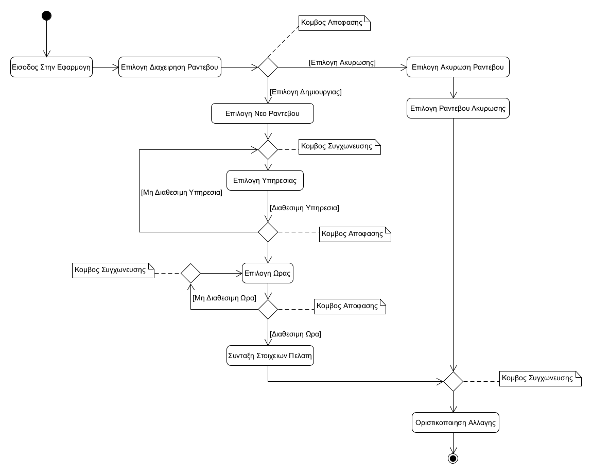
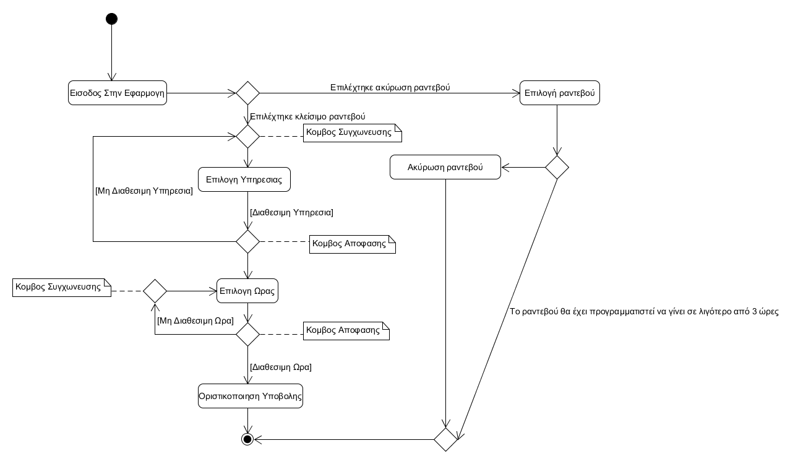
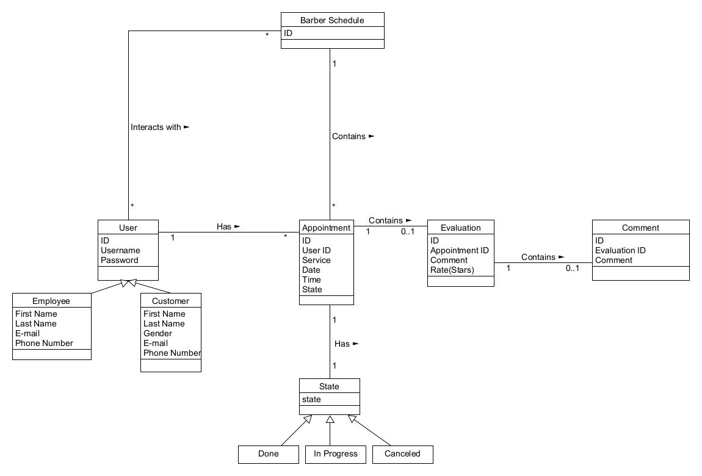
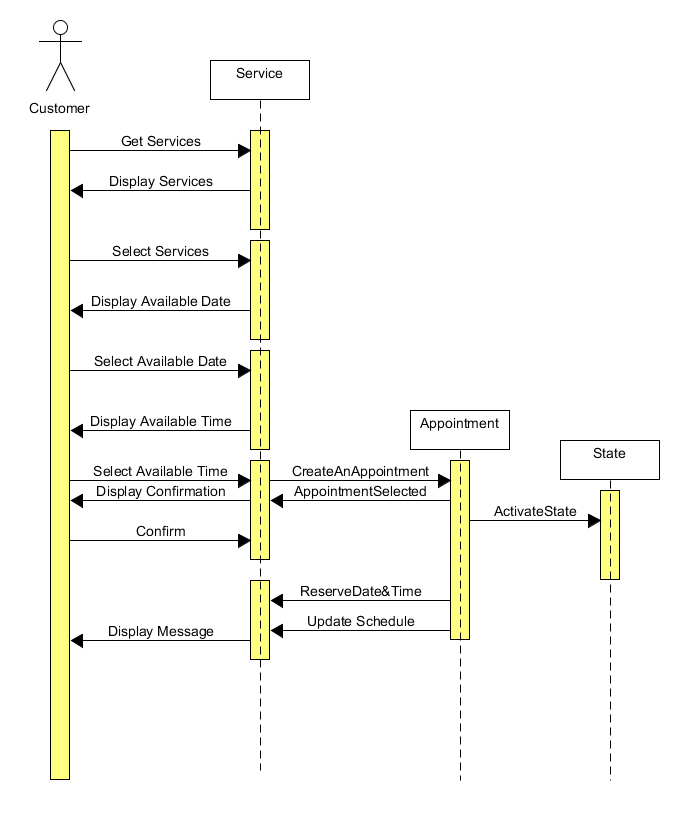
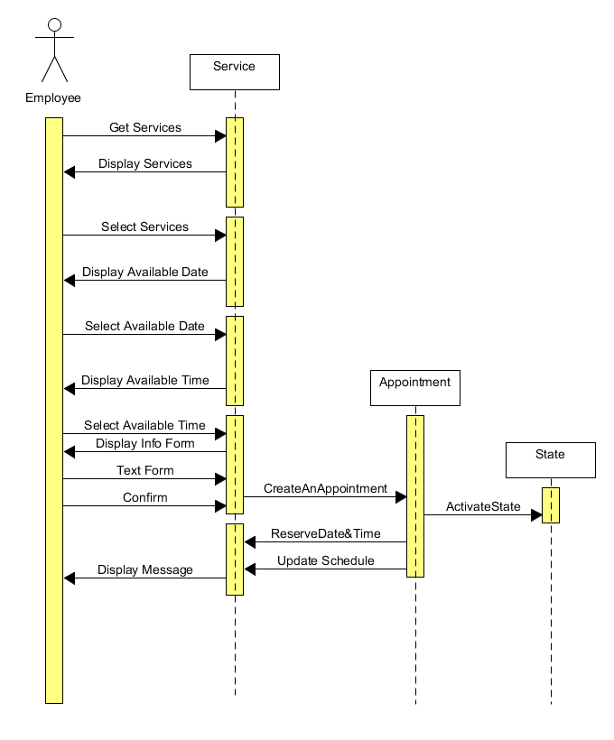
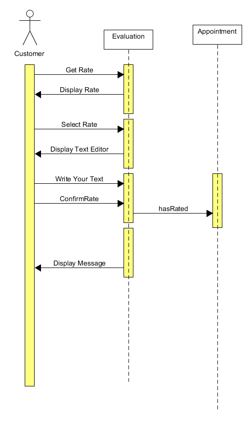

All Use Case For R2
========================

============================

Use Case:
------------------------- 
Κράτηση Ραντεβού

Main Actor:
--------------------------
Πελάτης

Προϋποθέσεις:
--------------------------
Να έχει πραγματοποιήσει εγγραφή στο σύστημα 

Βασική Ροή
--------------------------
1)	Ο πελάτης μπαίνει στην εφαρμογή.
2)	Το σύστημα εμφανίζει το menu.
3)	Ο πελάτης πατάει το Button «ΚΛΕΙΣΕ ΡΑΝΤΕΒΟΥ».
4)	Το σύστημα του εμφανίζει τις διαθέσιμες υπηρεσίες.
5)	Ο πελάτης επιλεγεί την υπηρεσία που επιθυμεί.
6)	Το σύστημα του εμφανίζει τις διαθέσιμες ώρες του καταστήματος.
7)	Ο πελάτης επιλέγει την ώρα/ημερομηνία όπου επιθυμεί να κλείσει ραντεβού.(Μπορεί να κλείσει ραντεβού έως και 7 μέρες πιο μετά από την μέρα που πραγματοποιεί το ραντεβού)
8)	Το σύστημα καταχωρεί το ραντεβού. 
9)	Ο πελάτης ενημερώνεται για την επιβεβαίωση του ραντεβού.
10)	 Το σύστημα ενημερώνει τις ελεύθερες ώρες του καταστήματος.
11)	Το σύστημα καταχωρεί τον πελάτη.
12)	Ο πελάτης επιστρέφει στο αρχικό menu.

*** Την διαδικασία αυτή ακολουθεί κάθε πελάτης όπου θέλει να κλείσει ραντεβού.
---------------
Εναλλακτική Ροή
---------------
3α) Ο πελάτης επιλέγει "ΤΑ ΡΑΝΤΕΒΟΥ ΜΟΥ".
    1)	Το σύστημα εμφανίζει στον πελάτη όλα τα ραντεβού που έχει προγραμματίσει.
    2)	Ο πελάτης επιλεγεί την ακύρωση ενός ραντεβού.
        2α) Το ραντεβού προβλέπεται να πραγματοποιηθεί σε λιγότερο από 3 ώρες.
            1) Το σύστημα εμφανίζει σχετικό μήνυμα.
            2) Ο πελάτης επιστρέφει στο αρχικό menu και η περίπτωση χρήσης τερματίζεται.
    3)	Το σύστημα καταργεί το ραντεβού του πελάτη και ενημερώνει τις διαθέσιμες ώρες.
    4)	Ο πελάτης επιστρέφει στο αρχικό menu και η περίπτωση χρήσης τερματίζεται.

5α)Η υπηρεσία όπου έχει επιλέξει ο πελάτης δεν είναι διαθέσιμη προσωρινά.
    1)	Το σύστημα ενημερώνει τον πελάτη ότι δεν υπάρχει η διαθέσιμη υπηρεσία προσωρινά.
    2) Το σύστημα εμφανίζει τις διαθέσιμες επιλογές ("ΑΡΧΙΚΟ MENU" και "ΔΙΑΦΟΡΕΤΙΚΗ ΥΠΗΡΕΣΙΑ").
    3) Ο πελάτης επιλέγει άλλη υπηρεσία.
        3α) Η υπηρεσία δεν είναι διαθέσιμη προσωρινά και επιστρέφουμε στην εκτέλεση του 5α.
        3β) Ο πελάτης επιλέγει "ΑΡΧΙΚΟ MENU".
            1) Ο πελάτης επιστρέφει στο αρχικό menu και η περίπτωση χρήσης τερματίζεται.

7α) Ο πελάτης δεν μπορεί να πραγματοποιήσει ραντεβού την ώρα που επέλεξε.
    1)	Το σύστημα ενημερώνει τον πελάτη ότι υπάρχει ήδη ραντεβού εκείνη την ώρα και του δίνει την δυνατότητα να διαλέξει κάποια άλλη ώρα ή να επιστρέψει στο αρχικό menu.
    2) Ο πελάτης επιλέγει άλλη ώρα.
        2α) Η ώρα δεν είναι διαθέσιμη και επιστρέφουμε στην εκτέλεση του 7α.
        2β) Ο πελάτης επιλέγει επιστροφή στο αρχικό menu και η περίπτωση χρήσης τερματίζεται.

Use Case: 
--------------------
Αξιολόγηση Υπηρεσίας

Main Actor: 
--------------------
Πελάτης

Προϋποθέσεις
--------------------
1)	Να έχει κλείσει το ραντεβού από την εφαρμογή.
2)	Να έχει πραγματοποιηθεί το ραντεβού.
3)	Να μην έχουν περάσει 7 μέρες από την πραγματοποίηση του ραντεβού.

Βασική Ροή
--------------------
1)	Ο πελάτης μπαίνει στην εφαρμογή.
2)	Το σύστημα εμφανίζει το menu.
3)	Ο πελάτης πατάει το Button «ΑΞΙΟΛΟΓΗΣΕΙΣ».
4)	Το σύστημα του εμφανίζει την δυνατότητα να δει τις ήδη υπάρχουσες αξιολογήσεις ή να συντάξει μια νέα.
5)	Ο πελάτης επιλεγεί την σύνταξη νέας αξιολόγησης.
6)	Το σύστημα του δίνει την δυνατότητα ενός text editor.
7)	Ο πελάτης αφού γράψει την αξιολόγηση του, μπορεί να την αναρτήσει στο διαθέσιμο forum.
8)	Το σύστημα καταχωρεί την αξιολόγηση και πλέον είναι ορατή σε όλους τους χρήστες.
9)	Ο πελάτης επιστρέφει στο αρχικό menu. 

*** Την διαδικασία αυτή ακολουθεί κάθε πελάτης όπου θέλει να κλείσει ραντεβού.
-------------------
Εναλλακτική Ροή
--------------------
5α)Η σύνταξη νέας αξιολόγησης μπορεί να μην πραγματοποιηθεί εφόσον το ραντεβού δεν τηρεί τις προϋποθέσεις 
    1) Το σύστημα εμφανίζει κατάλληλο μήνυμα.
    2) Ο πελάτης επιστρέφει στο αρχικό menu, τερματίζοντας την περίπτωση χρήσης.

Use Case: 
------------
Διαχείριση Ραντεβού Πελάτη

Main Actor: 
-------------
Υπάλληλος

Προϋποθέσεις -
--------------------
Βασική Ροή
----------------------
1)	Ο υπάλληλος μπαίνει στην εφαρμογή.
2)	Το σύστημα εμφανίζει το menu.
3)	Ο υπάλληλος  πατάει το Button «ΔΙΑΧΕΙΡΗΣΗ ΡΑΝΤΕΒΟΥ».
4)	Το σύστημα εμφανίζει τις επιλογές "ΔΗΜΙΟΥΡΓΙΑ ΡΑΝΤΕΒΟΥ" και "ΑΚΥΡΩΣΗ ΡΑΝΤΕΒΟΥ".
5) Ο υπάλληλος επιλέγει "ΔΗΜΙΟΥΡΓΙΑ ΡΑΝΤΕΒΟΥ"
6)	Το σύστημα του εμφανίζει τις διαθέσιμες υπηρεσίες.
7)	Ο υπάλληλος επιλεγεί την υπηρεσία που επιθυμεί ο πελάτης.
8)	Το σύστημα του εμφανίζει τις διαθέσιμες ώρες του καταστήματος.
9)	Ο υπάλληλος επιλέγει την ώρα όπου επιθυμεί να κλείσει ραντεβού ο πελάτης.
10)	Το σύστημα ζητάει τα προσωπικά στοιχεία του πελάτη.
11)	Ο υπάλληλος ενημερώνει το σύστημα για τα στοιχεία του πελάτη.
12)	Το σύστημα καταχωρεί τα στοιχεία του πελάτη και το ραντεβού. 
13)	Ο υπάλληλος ενημερώνεται για την επιβεβαίωση του ραντεβού.
14)	 Το σύστημα ενημερώνει τις διαθέσιμες ώρες του καταστήματος.
15) Ο υπάλληλος επιστρέφει στο αρχικό menu.

*** Την διαδικασία αυτή ακολουθεί υπάλληλος για κάθε πελάτης όπου θέλει να κλείσει ραντεβού με διαφορετικό μέσο(Τηλεφωνική κλήση – Διά ζώσης επικοινωνία).
----------------
Εναλλακτική Ροή
--------------------
5β) Ο υπάλληλος επιλέγει "ΑΚΥΡΩΣΗ ΡΑΝΤΕΒΟΥ".
    1) Το σύστημα εμφανίζει τα ενεργά ραντεβού.
    2) Ο υπάλληλος επίλεγει το ραντεβού που επιθυμεί.
    3) Το σύστημα ακυρώνει το ραντεβού.
        3α) Το ραντεβού έχει προγραμματίστει να πραγματοποιηθεί σε λιγότερο από 3 ώρες.
            1) Το σύστημα εμφανίζει κατάλληλο μήνυμα.
            2) Ο υπάλληλος επιστρέφει στο αρχικό menu και η περίπτωση χρήσης τερματίζεται.
    4) Το σύστημα ενημερώνει τις διαθέσιμες ώρες του καταστήματος.
    5) Ο υπάλληλος επιστρέφει στο αρχικό menu και η περίπτωση χρήσης τερματίζεται.

7α) Η υπηρεσία όπου έχει επιλέξει ο υπάλληλος δεν είναι διαθέσιμη προσωρινά.
    1)	Το σύστημα ενημερώνει τον υπάλληλο ότι δεν υπάρχει η διαθέσιμη υπηρεσία προσωρινά και εμφανίζει τις διαθέσιμες επιλογές ("ΑΡΧΙΚΟ MENU" και "ΔΙΑΦΟΡΕΤΙΚΗ ΥΠΗΡΕΣΙΑ").
    2)	Ο υπάλληλος έχει την δυνατότητα να επιστρέψει στο αρχικό menu ή να επιλέξει κάποια άλλη υπηρεσία
    3) Ο υπάλληλος επιλέγει άλλη υπηρεσία.
        3α) Η υπηρεσία δεν είναι διαθέσιμη προσωρινά και επιστρέφουμε στην εκτέλεση του 7α.
        3β) Ο υπάλληλος επιλέγει "ΑΡΧΙΚΟ MENU".
            1) Ο υπάλληλος επιστρέφει στο αρχικό menu και η περίπτωση χρήσης τερματίζεται.

9α) Η συγκεκριμένη ώρα δεν είναι διαθέσιμη.
    1) Το σύστημα ενημερώνει τον υπάλληλο ότι υπάρχει ήδη ραντεβού εκείνη την ώρα και του δίνει την δυνατότητα να διαλέξει κάποια άλλη ώρα ή να επιστρέψει στο αρχικό menu.
    2) Ο υπάλληλος επιλέγει άλλη ώρα.
        2α) Η ώρα δεν είναι διαθέσιμη και επιστρέφουμε στην εκτέλεση του 9α.
        2β) Ο υπάλληλος επιλέγει επιστροφή στο αρχικό menu και η περίπτωση χρήσης τερματίζεται.

11α) Δεν υπάρχει πελάτης με αυτά τα στοιχεία.
    1) Το σύστημα εμφανίζει κατάλληλο μήνυμα.
    2) Το σύστημα εμφανίζει τις διαθέσιμες επιλογές ("ΑΡΧΙΚΟ MENU" και "ΞΑΝΑΠΡΟΣΠΑΘΗΣΕ").
    3) Ο υπάλληλος επιλέγει "ΞΑΝΑΠΡΟΣΠΑΘΗΣΕ".
        3α) Ο υπάλληλος επιλέγει "ΑΡΧΙΚΟ MENU".
            1) Ο υπάλληλος επιστρέφει στο αρχικό menu και η περίπτωση χρήσης τερματίζεται.
    4) Το σύστημα ζητάει τα προσωπικά στοιχεία του πελάτη.
    5)	Ο υπάλληλος ενημερώνει το σύστημα για τα στοιχεία του πελάτη.
        5α) Δεν υπάρχει πελάτης με αυτά τα στοιχεία.
            1) Επιστροφή στην εκτέλεση του 11α.

Use Case: 
-------------------
Διαχείριση Διαθεσιμότητας/Υπηρεσιών 

Main Actor: 
------------------
Υπάλληλος

Προϋποθέσεις -
------------------
Βασική Ροή
------------------
1)	Ο υπάλληλος μπαίνει στην εφαρμογή.
2)	Το σύστημα εμφανίζει το menu.
3)	Ο υπάλληλος πατάει το Button «Διαχείριση».
4)	Το σύστημα του εμφανίζει τις διάφορες υπηρεσίες(ώρα/υπηρεσίες καταστήματος) που μπορεί να διαχειριστή ο υπάλληλος.
5)	Ο υπάλληλος επιλεγεί την υπηρεσία που θέλει να αλλάξει(ώρα/υπηρεσίες καταστήματος ) και τροποποιεί αυτά που θέλει.(Η τροποποίηση ισχύει για 7 μέρες μετά από την αλλαγή)
6)	Το σύστημα καταχωρεί της τροποποιήσεις του υπάλληλου.
7)	Ο υπάλληλος ενημερώνεται για την πραγματοποίηση της τροποποιήσεις.
*** Την διαδικασία αυτή ακολουθεί ο υπάλληλος οπότε θέλει να κάνει κάποια αλλαγή στο σύστημα.

Use Case: 
------------------------
Προβολή Στατιστικών 

Main Actor: 
-----------------------
Υπάλληλος
Προϋποθέσεις -
------------------------
Βασική Ροή
-----------------------
1)	Ο υπάλληλος μπαίνει στην εφαρμογή.
2)	Το σύστημα εμφανίζει το menu.
3)	Ο υπάλληλος πατάει το Button «Ενημέρωση».
4)	Το σύστημα του εμφανίζει ένα σύνολο από πληροφορίες.
5)	Ο υπάλληλος επιλέγει αυτή που τον ενδιαφέρει.
6)	Το σύστημα του εμφανίζει περισσότερες λεπτομέρειες για την επιλογή του υπαλλήλου.

*** Την διαδικασία αυτή ακολουθεί ο υπάλληλος οπότε θέλει να κάνει δει διάφορες πληροφορίες σχετικά με το κατάστημα.
------------------------

Μη λειτουργικές απαιτήσεις
--------------------------
1) Τα στοιχεία κάθε χρήστη αποθηκεύονται στη βάση δεδομένων και είναι προσβάσιμα αποκλειστικά από τους διαχειριστές του συστήματος και απο τους χρήστες στους οποίους ανήκουν.
2) Το σύστημα μπορεί να διαχείριζεται τον φόρτο πολλαπλών χρηστών.
3) Το σύστημα ανταποκρίνεται γρήγορα στα αιτήματα του χρήστη.

All Activity For R2
========================

Activity Diagram For Making A Rating As  Customer
---------------------------

============================

Activity Diagram For Making An Appointment OR Delete A Date As Employee
---------------------------

============================

Activity Diagram For Making An Appointment As Customer
---------------------------

============================

Class Diagram R2
========================

============================

Sequence Diagram For R2
========================

Sequence Diagram For Making An Appointment As Customer
---------------------------

============================

Sequence Diagram For Making An Appointment As Employee
---------------------------

============================

Sequence Diagram For Making A Rating As  Customer
---------------------------

============================

