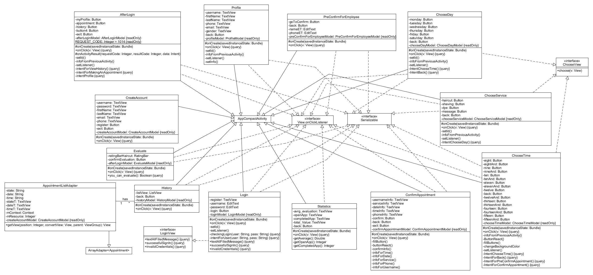

All Diagrams For R4 And Coverage Report
========================

Class Diagram For Activities
========================

============================

Class Diagram For Controller
========================

============================

Class Diagram For Database
========================

============================

Class Diagram For Logic
========================

============================

Class Diagram For Model
========================

============================

Sequence Diagram For Cancel An Appointment As Employee
---------------------------

============================

Sequence Diagram For Cancel An Appointment As Customer
---------------------------

============================

Sequence Diagram For Show Statistics
---------------------------

============================

Sequence Diagram For Show Profile Info
---------------------------

============================

Sequence Diagram For Making An Appointment As Customer
---------------------------

============================

Sequence Diagram For Making An Appointment As Employee
---------------------------

============================

Sequence Diagram For Verification
---------------------------

============================

Coverage Report
========================

============================

Coverage Report For Controller
========================

============================

Coverage Report For Database
========================

============================

Coverage Report For Logic
========================

============================

Coverage Report For Model
========================

============================
